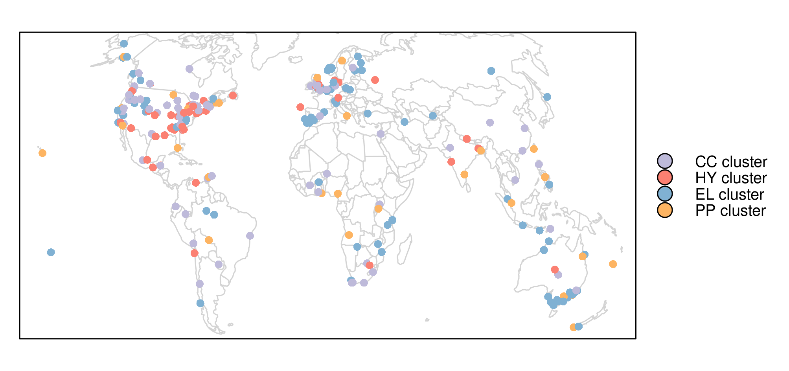

## Reviewing qualitative GIS research – towards a wider usage of open source GIS and reproducible research practices

This is the online code repository of the Geography Compass publication
“Reviewing qualitative GIS research – towards a wider usage of open
source GIS and reproducible research practices”.

The [data](https://github.com/jannes-m/qual_gis/tree/master/data) is
analyzed in the scripts found under
[code](https://github.com/jannes-m/qual_gis/tree/master/code).
[images](https://github.com/jannes-m/qual_gis/tree/master/images) and
[figures](https://github.com/jannes-m/qual_gis/tree/master/figures)
contain the output of the corresponding analyses.

To install all required packages for this analysis, please execute

``` r
renv::init()
renv::install()
```

from the repository root. The *renv* package is the successor of the
*packrat* package and can be installed using
`remotes::install_github("rstudio/renv")`. This will create a
project-based R library with R packages being kept at a specific version
for reproducibility.

The online version of the figure below (Figure 4 in the manuscript) can
be viewed [here](http://edi.geogr.uni-jena.de:3838/jannes/cluster_map/).

<p align = "center">

<figure>



<figcaption>

<font size="1">Mapping the study areas of the classified publications.
Abbreviations: CC = Conceptional contributions to qualitative GIS; HY =
Health, youth and the urban environment; EL = Ecology services,
landscapes and tourism; PP = Theory and empiricism of Public
Participation GIS. </font>

</figcaption>

</figure>

</p>
